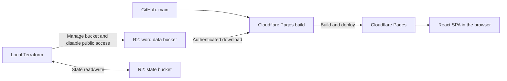

# type-words

An English typing practice SPA built with React, TypeScript, and Vite, with a chalkboard-inspired interface.

## Architecture



Pages builds automatically from `main`; preview deployments are disabled.

## Structure

- `app/src/`: Screens, components, and practice logic under `domain/practice/`
- `app/public/`: Favicons and Web App Manifest
- `app/test/`: Vitest and React Testing Library tests
- `app/scripts/`: Build preparation
- `app/`: npm, Vite, TypeScript, and Biome configuration
- `infra/`: Terraform definitions for the word data bucket and its public access setting
- `mise.toml`: Node.js and Terraform versions
- `.github/workflows/pr-checks.yml`: Application checks using example data

## Development

Install and activate [mise](https://mise.jdx.dev/getting-started.html), then:

```sh
git clone https://github.com/kazuy/type-words.git
cd type-words
mise trust
mise install
cd app
npm ci
cp words.json.example words.json
npm run dev
```

```sh
npm run lint
npm test
npm run build
```

## Deployment

Terraform creates the R2 bucket for `words.json`. Run from the repository root:

```sh
cp infra/terraform.tfvars.example infra/terraform.tfvars
```

```sh
export AWS_ACCESS_KEY_ID='<STATE_ACCESS_KEY_ID>'
export AWS_SECRET_ACCESS_KEY='<STATE_SECRET_ACCESS_KEY>'
export CLOUDFLARE_API_TOKEN='<TERRAFORM_MANAGEMENT_TOKEN>'

mise exec -- terraform -chdir=infra init \
  -backend-config='bucket=<STATE_BUCKET_NAME>' \
  -backend-config='endpoints={s3="https://<ACCOUNT_ID>.r2.cloudflarestorage.com"}'
mise exec -- terraform -chdir=infra fmt -check -diff
mise exec -- terraform -chdir=infra validate
mise exec -- terraform -chdir=infra plan -out=terraform.tfplan
```

Review the plan, then apply it:

```sh
mise exec -- terraform -chdir=infra apply terraform.tfplan
unset AWS_ACCESS_KEY_ID AWS_SECRET_ACCESS_KEY CLOUDFLARE_API_TOKEN
```

### Build script

Run `npm run build:pages` from `app/`. Configure these R2 environment variables as encrypted secrets in Cloudflare Pages:

| Variable | Value |
| --- | --- |
| `R2_ACCOUNT_ID` | Account ID |
| `R2_BUCKET_NAME` | Word data bucket name |
| `R2_ACCESS_KEY_ID` | Access Key ID |
| `R2_SECRET_ACCESS_KEY` | Secret Access Key |
