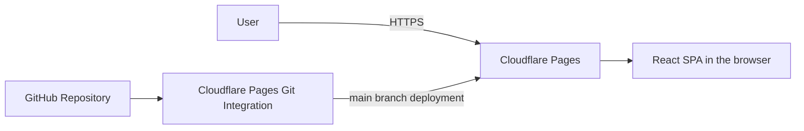

# type-words

type-words is an English typing practice project built with React and TypeScript, with a chalkboard-inspired interface.

## Architecture

The app is a fully client-side React SPA, with no backend, database, or authentication. It uses React state without React Router.



Cloudflare Pages Git integration handles production deployment from `main`. GitHub Actions handles quality checks.

## Project structure

- `app/src/`: React and TypeScript UI components and styles
  - `pages/`: Top, practice settings, and typing practice screens
  - `components/`: Individual practice settings and shared radio controls
- `app/src/domain/practice/`: Word entry types, practice question generation, and typing text normalization
- `app/public/`: Favicons and Web App Manifest
- `app/test/`: Tests using Vitest and React Testing Library
- `app/index.html`: HTML entry point
- `app/vite.config.ts`: Vite and test configuration
- `app/biome.json`: Linting and formatting configuration
- `app/scripts/`: Build preparation scripts
- `infra/`: Terraform configuration for the private word data bucket
- `mise.toml`: Pinned Node.js and Terraform versions
- `.github/workflows/pr-checks.yml`: Pull request checks

## First-time setup

Install [mise](https://mise.jdx.dev/getting-started.html) and activate it in your shell, then run:

```sh
git clone https://github.com/kazuy/type-words.git
cd type-words
mise trust
mise install
node --version
cd app
npm ci
```

Confirm that `node --version` matches `mise.toml`. npm is bundled with Node.js.

## Local development

Run npm commands from `app/`.

```sh
npm run dev
```

Open the local URL printed by Vite in your browser.

## Checks and formatting

```sh
npm run lint
npm test
npm run build
```

Use `npm run format` to format files and `npm run test:watch` to run tests in watch mode. The lint command checks files without modifying them.

Production builds are written to `app/dist/`. Run `npm run preview` after building to preview the result locally.

GitHub Actions runs lint, tests, and build on pull requests targeting `main`. When changing Node.js versions, update both `mise.toml` and the CI workflow.

## Word data

From `app/`, create the local word data file before starting the app or running checks:

```sh
cp words.json.example words.json
```

Replace the example with your words and sentences using the same structure. `words.json` is ignored by Git; CI uses the example. Production builds require the real file to be supplied separately before building, including when using Cloudflare Pages Git integration.

The data is bundled into JavaScript without a standalone JSON URL, but can be inspected in the delivered JavaScript.
